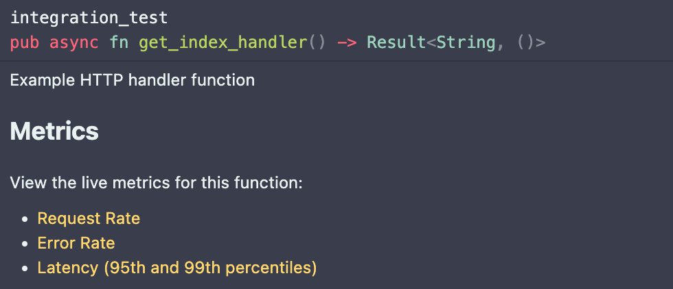

# Autometrics
> Understand your system easily using automatically generated metrics and pre-built Prometheus queries.

Autometrics provides a macro for instrument functions throughout your code base.
It creates metrics for you and then offers customized Prometheus queries for you to run to observe your system in production.

Autometrics currently generates the following queries for each instrumented function:
- Request rate
- Error rate
- Latency (95th and 99th percentiles)
- Concurrent requests

## Example

```rust
use autometrics::{autometrics, global_metrics_exporter, encode_global_metrics};
use axum::{routing::get, Router};
use http::StatusCode;

/// Example HTTP handler function
#[autometrics]
pub async fn get_index_handler(db: Database, request: Request<Body>) -> Result<String, ()> {
  let foo = db.load_something_important().await;
  Ok("It worked!".to_string())
}

/// Export the collected metrics in the Prometheus format
pub fn get_metrics() -> (StatusCode, String) {
  match encode_global_metrics() {
    Ok(metrics) => (StatusCode::OK, metrics),
    Err(err) => (StatusCode::INTERNAL_SERVER_ERROR, format!("{:?}", err))
  }
}

pub fn main() {
  let _exporter = global_metrics_exporter();

  let app = Router::new()
    .route("/", get(get_index_handler))
    .route("/metrics", get(get_metrics));
}
```

If you hovered over the `get_index_handler` definition in VS Code with Rust Analyzer installed, you would see:



And clicking each of the metric links would take you straight to the Prometheus chart for that specific function.

## API

### `#[autometrics]` Macro

For most use cases, you can simply add the `#[autometrics]` attribute to any function you want to collect metrics for. We recommend using it for any important function in your code base (HTTP handlers, database calls, etc), possibly excluding simple utilities that are infallible or have negligible execution time.

### Result Type Labels

By default, the metrics generated will have labels for the `function`, `module`, and `result` (where the value is `ok` or `error` if the function returns a `Result`).

The concrete result type(s) (the `T` and `E` in `Result<T, E>`) can also be included as labels if the types implement `Into<&'static str>`.

For example, if you have an `Error` enum to define specific error types, you can have the enum variant names included as labels:
```rust
use strum::IntoStaticStr;

#[derive(IntoStaticStr)]
#[strum(serialize_all = "snake_case")]
pub enum MyError {
  SomethingBad(String),
  Unknown,
  ComplexType { message: String },
}
```
In the above example, functions that return `Result<_, MyError>` would have an additional label `error` added with the values `something_bad`, `unknown`, or `complex_type`.

#### Why no dynamic labels?

Autometrics only supports `&'static str`s as labels to avoid the footgun of attaching labels with too many possible values. The [Prometheus docs](https://prometheus.io/docs/practices/naming/#labels) explain why this is important in the following warning:

> CAUTION: Remember that every unique combination of key-value label pairs represents a new time series, which can dramatically increase the amount of data stored. Do not use labels to store dimensions with high cardinality (many different label values), such as user IDs, email addresses, or other unbounded sets of values.

## Exporting Prometheus Metrics

Autometrics includes optional functions to help collect and prepare metrics to be collected by Prometheus.

In your `Cargo.toml` file, enable the optional `prometheus-exporter` feature:

```toml
autometrics = { git = "ssh://git@github.com/fiberplane/autometrics-rs.git", branch = "main", features = ["prometheus-exporter"] }
```

Then, call the `global_metrics_exporter` function in your `main` function:
```rust
pub fn main() {
  let _exporter = global_metrics_exporter();
  // ...
}
```

And create a route on your API (probably mounted under `/metrics`) that returns the following:
```rust
pub fn get_metrics() -> (StatusCode, String) {
  match encode_global_metrics() {
    Ok(metrics) => (StatusCode::OK, metrics),
    Err(err) => (StatusCode::INTERNAL_SERVER_ERROR, format!("{:?}", err))
  }
}
```

## Configuring

### Custom Prometheus URL
By default, Autometrics creates Prometheus query links that point to `http://localhost:9090`.

You can configure a custom Prometheus URL by adding the following to your `build.rs` file:

```rust
let prometheus_url = "https://your-prometheus-url.example";
println!("cargo:rustc-env=PROMETHEUS_URL={prometheus_url}");
```

For example:
```rust
// build.rs

fn main() {
  let prometheus_url = "https://your-prometheus-url.example";
  println!("cargo:rustc-env=PROMETHEUS_URL={prometheus_url}");
}
```
Note that when using Rust Analyzer, you'll need to reload the workspace in order for the changed URL to take effect.
