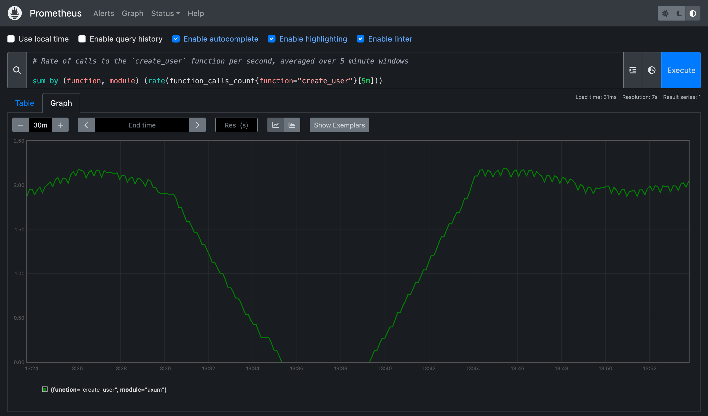

# Autometrics 📈✨

[](https://docs.rs/autometrics)
[](https://crates.io/crates/autometrics)
[](https://discord.gg/kHtwcH8As9)

**A macro that makes it easy to understand the error rate, response time, and production usage of any function in your code.** Jump straight from your IDE to live Prometheus charts for each HTTP/RPC handler, database method, or other piece of application logic.

## Features
- ✨ [`#[autometrics]`](https://docs.rs/autometrics/latest/autometrics/attr.autometrics.html) macro instruments any function or `impl` block to track the most useful metrics
- 💡 Writes Prometheus queries so you can understand the data generated without knowing PromQL
- 🔗 Injects links to live Prometheus charts directly into each function's doc comments
- 📊 (Coming Soon!) Grafana dashboard showing the performance of all instrumented functions
- 🚨 Generates Prometheus alerting rules using SLO best practices from simple annotations in your code
- ⚙️ Configurable metric collection library (`opentelemetry`, `prometheus`, or `metrics`)
- ⚡ Minimal runtime overhead

See [Why Autometrics?](./docs/why.md) for more details on the ideas behind autometrics.

## Usage

### 1️⃣ Add `#[autometrics]` to any function or `impl` block

```rust
#[autometrics]
async fn create_user(Json(payload): Json<CreateUser>) -> Result<Json<User>, ApiError> {
  // ...
}

#[autometrics]
impl Database {
  async fn save_user(&self, user: User) -> Result<User, DbError> {
    // ...
  }
}
```

### 2️⃣ Hover over the function name to see the generated queries


### 3️⃣ Click a query link to go directly to the Prometheus chart for that function



### 4️⃣ Go back to shipping features 🚀

## Examples

To see autometrics in action:

1. Install [prometheus](https://prometheus.io/download/) locally
2. Run the [complete example](./examples/full-api):
```
cargo run -p example-full-api serve
```
3. Hover over the [function names](./examples/full-api/src/routes.rs#L13) to see the generated query links
(like in the image above) and try clicking on them to go straight to that Prometheus chart.

See the other [examples](./examples/) for details on how to use the various features and integrations.

## Optional Features

### Exporting Prometheus Metrics

Autometrics includes optional functions to help collect and prepare metrics to be collected by Prometheus.

In your `Cargo.toml` file, enable the optional `prometheus-exporter` feature:

```toml
autometrics = { version = "*", features = ["prometheus-exporter"] }
```

Then, call the `global_metrics_exporter` function in your `main` function:
```rust
pub fn main() {
  let _exporter = autometrics::global_metrics_exporter();
  // ...
}
```

And create a route on your API (probably mounted under `/metrics`) that returns the following:
```rust
pub fn get_metrics() -> (StatusCode, String) {
  match autometrics::encode_global_metrics() {
    Ok(metrics) => (StatusCode::OK, metrics),
    Err(err) => (StatusCode::INTERNAL_SERVER_ERROR, format!("{:?}", err))
  }
}
```

### Alerts / SLOs

Autometrics can generate [alerting rules](https://prometheus.io/docs/prometheus/latest/configuration/alerting_rules/) for Prometheus based on simple annotations in your code. The specific rules are based on [Sloth](https://sloth.dev/) and the Google SRE Workbook section on [Service-Level Objectives (SLOs)](https://sre.google/workbook/alerting-on-slos/).

In your `Cargo.toml` file, enable the optional `alerts` feature:

```toml
autometrics = { version = "*", features = ["alerts"] }
```

Then, pass the `alerts` argument to the `autometrics` macro **for 1-3 top-level functions**:
```rust
#[autometrics(alerts(success_rate = 99.9%, latency(99% <= 200ms)))]
pub async fn handle_http_requests(req: Request) -> Result<Response, Error> {
  // ...
}
```

Use the `generate_alerts` function to produce the [Prometheus rules YAML file](https://prometheus.io/docs/prometheus/latest/configuration/alerting_rules/):
```rust
fn print_prometheus_alerts() {
  println!("{}", autometrics::generate_alerts());
}
```

Take a look at the [alerts example](./examples/alerts) to see how to integrate generating the alert definitions into your Clap-based binary.

Refer to the Prometheus docs section on [Alerting](https://prometheus.io/docs/alerting/latest/overview/) for more details on configuring Prometheus to use the alerting rules and on how to use [Alertmanager](https://prometheus.io/docs/alerting/latest/alertmanager/) to de-duplicate alerts.

## Configuring

### Custom Prometheus URL
By default, Autometrics creates Prometheus query links that point to `http://localhost:9090`.

You can configure a custom Prometheus URL using a build-time environment in your `build.rs` file:

```rust
// build.rs

fn main() {
  let prometheus_url = "https://your-prometheus-url.example";
  println!("cargo:rustc-env=PROMETHEUS_URL={prometheus_url}");
}
```
Note that when using Rust Analyzer, you may need to reload the workspace in order for URL changes to take effect.


### Feature flags

- `alerts` - generate Prometheus [alerting rules](#alerts--slos) to notify you when a given function's error rate or latency is too high
- `prometheus-exporter` - exports a Prometheus metrics collector and exporter (compatible with any of the Metrics Libraries)

#### Metrics Libraries

Configure the crate that autometrics will use to produce metrics by using one of the following feature flags:

- `opentelemetry` (enabled by default) - use the [opentelemetry](https://crates.io/crates/opentelemetry) crate for producing metrics
- `metrics` - use the [metrics](https://crates.io/crates/metrics) crate for producing metrics
- `prometheus` - use the [prometheus](https://crates.io/crates/prometheus) crate for producing metrics
